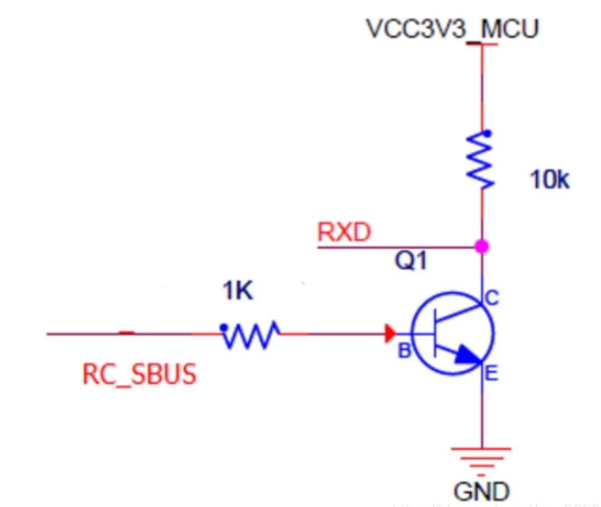
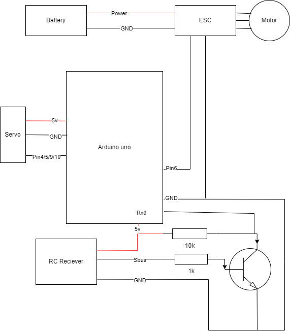

## This project includes:
### sbus_to_pwm_uno : converting sbus to pwm
- s.bus (or d.bus, w.bus, etc) is a kind of serial communication invented by futaba for RC models. It contains 18 integers representing the value of 18 channels, which can be prossessed faster than ppm and pwm. It is encoded and need to be decode with hardware and code. Furthermore, the decoded values will be output as pwm signals to control ESCs and Servos, which control the plane directly.
- sbus reciever is connected to rx0 of the arduino uno via a converter:

pwm output at digital pin 3,5,6,9,10 (ch1,ch2,ch3,ch4,ch5)
- connection:

